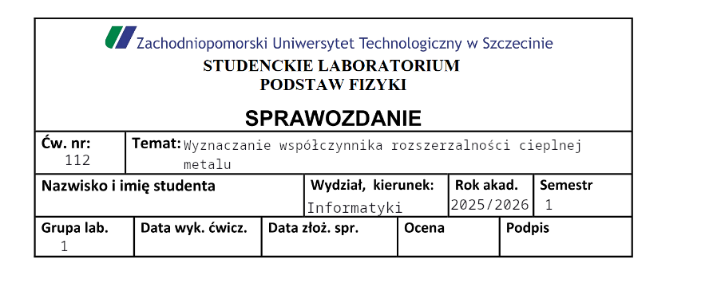

# Cel
Wyznaczanie współczynnika rozszerzalności liniowej metalu
# Wstęp teoretyczny
Rozszerzalność cieplna to zjawisko, które polega na zwiększaniu się rozmiarów ciała pod wpływem ciepła. Wyróżniamy rozszerzalność cieplną ciał stałych, cieczy i gazów. Zjawisko to wynika z tego, że wraz ze wzrostem temperatury rośnie energia drgań cząstek składowych ciał, przez co rośnie średnia odległość między nimi. Wyjątkiem od tej zasady jest woda. Zjawisko to opisujemy za pomocą współczynnika rozszerzalności liniowej $\alpha$ lub objętościowej $\gamma$.

W celu zrozumienia powodu rozszerzania się ciał, musimy spojrzeć na potencjał oddziaływania międzyatomowego. Gdyby drgania w sieci krystalicznej były harmoniczne, czyli wykres energii potencjalnej byłby idealnie symetryczną parabolą, średnia odległość między atomami nie zmieniłaby się ze wzrostem energii. W rzeczywistości jednak drgania są anharmoniczne. Przy zbliżaniu się atomów siły odpychania rosną gwałtownie, zaś przy oddalaniu maleją wolniej.

Przy różnicy temperatur nieprzekraczającej kilkudziesięciu stopni przyrost długości jest proporcjonalny do przyrostu długości.

Wrzenie to proces parowania w całej objętości cieczy. Rozpoczyna się ono w takiej temperaturze, w której ciśnienie pary nasyconej równe jest ciśnieniu zewnętrznemu. Temperatura wrzenia zależy więc od ciśnienia zewnętrznego i wzrasta wraz z jego wzrostem. Nie jest to zależność wprost proporcjonalna, a jej charakter zależy od rodzaju cieczy. Podczas wrzenia temperatura jest stała pomimo dostarczania do cieczy ciepła. Całe pobrane przez ciecz ciepło zużywane jest na zmianę stanu skupienia z ciekłego na gazowy.

Doświadczalna weryfikacja tego zjawiska w przypadku ciał stałych odbywa się za pomocą przyrządu zwanego dylatometrem. Pozwala on na precyzyjny pomiar zmian wymiarów próbki pod wpływem ogrzewania. Schemat tego urządzenia widoczny jest poniżej:

Na podstawie uzyskanych danych pomiarowych, współczynnik rozszerzalności liniowej $\alpha$ wyznaczamy, korzystając z poniższej zależności:
$$
\alpha = \frac{\Delta l}{l_{0} \cdot \Delta t}
$$
Gdzie: Δl – przyrost długości, $l_{0}$​ – długość początkowa, Δt – różnica temperatur.